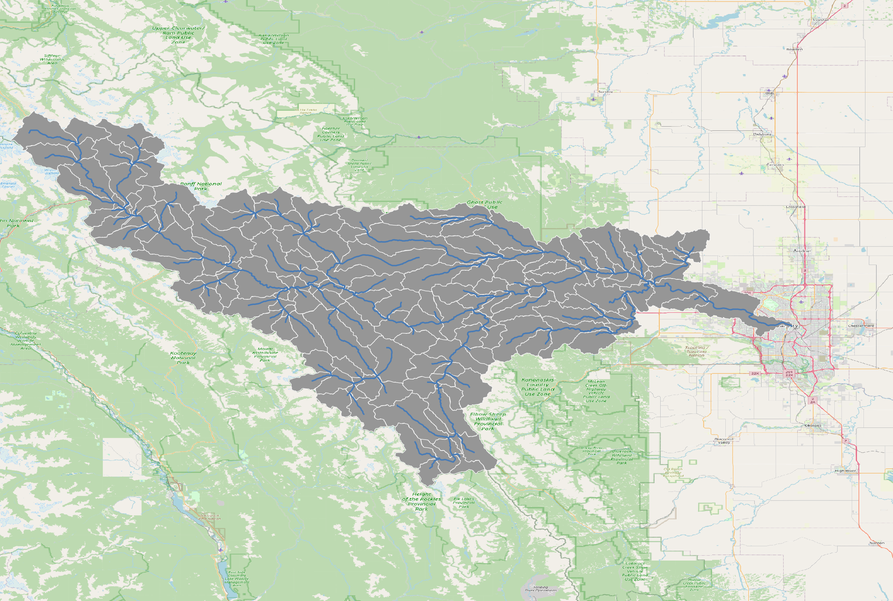
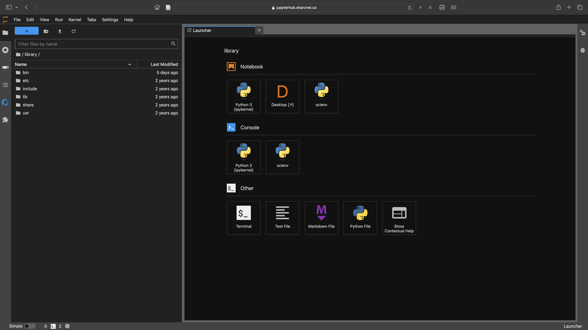

# Training session to set up ECCC National Water Model `MESH` for the Bow River at Calgary Watershed


To download this repository on the `$HOME` directory of your Narval account:
```console
foo@narval1:~$ mkdir -p $HOME/github-repos/alliancecan-training/
foo@narval1:~$ git clone https://github.com/kasra-keshavarz/alliancecan-training.git ./github-repos/alliancecan-training
```

# Library requirements
## General
Certain libraries and binary executables are necessary to run the
workflows in this repository. Below necessary libraries for general usage
are mentioned:
```console
1. CDO (Climate Data Operators >=v2.2.1),
2. ecCodes (>=v2.25.0),
3. Expat XML parser (>=v2.4.1),
4. GDAL (>=3.5.1),
5. GEOS (>=3.10.2),
6. HDF5 (>=1.10.6),
7. JasPer (>=2.0.16),
8. libaec (>=1.0.6),
9. libfabric (>=1.10.1),
10. libffi (>=3.3),
11. libgeotiff (>=1.7.1),
12. librttopo (>=1.1.0),
13. libspatialindex (>=1.8.5),
14. libspatilite (>=5.0.1),
15. netcdf-fortran (>=4.5.2),
16. netcdf (>=4.7.4),
17. postgresql (>=12.4),
18. proj (>=9.0.1),
19. python (>=3.10.2),
20. sqlite (>=3.38.5),
21. udunits (>=2.2.28)
```
Each of the above libraries and binaries may need further dependencies. It
is up to the user to assure all requirements are satisfied. Most GNU/Linux
distributions should be able to offer all the libraries above through
their remote package repositories. If not, it is recommended to compile
and store them for future use.

## Digital Research Alliance of Canada (DRAC) Narval HPC
Fortunately, all the above requirements are available on the DRAC
HPCs. You may load the modules with the following command:
```console
foo@narval1:~$ module load StdEnv/2020
foo@narval1:~$ module load gcc/9.3.0
foo@narval1:~$ module load \
  sqlite/3.38.5 postgresql/12.4 gdal/3.5.1 \
  udunits/2.2.28 cdo/2.2.1 gentoo/2020 \
  imkl/2020.1.217 openmpi/4.0.3 libfabric/1.10.1 \
  jasper/2.0.16 freexl/1.0.5 geos/3.10.2 \
  libaec/1.0.6 mpi4py/3.1.3 \
  libffi/3.3 hdf5/1.10.6 \
  libgeotiff-proj901/1.7.1 librttopo-proj9/1.1.0 \
  proj/9.0.1 eccodes/2.25.0 netcdf-fortran/4.5.2 \
  mii/1.1.2 ucx/1.8.0 python/3.10.2 \
  netcdf/4.7.4 cfitsio/4.1.0 \
  libspatialite-proj901/5.0.1 expat/2.4.1 \
  yaxt/0.9.0 libspatialindex/1.8.5 arrow/13.0.0 \
  scipy-stack/2023b ipykernel/2023b;
```

> [!NOTE]
> Both `scipy-stack/2023b` and `ipykernel/2023b` need to be loaded at the
> end to assure the `sys.path` addresses in Python sessions are ordered as
> expected.


It is recommended to save all loaded modules as a list to be able to restore
them whenever needed. Using the LMOD features, you may save them with:
```console
foo@narval1:~$ module save hydrology-modules
```

And, you may restore the list with:
```console
foo@narval1:~$ module restore hydrology-modules
```
> [!NOTE]
> Please note that some of the libraries and binary programs are necessary
for the Python environment to run smoothly (see below).

# Python requirements
## General
The following list of Python packages are required to run much of the
workflows in this repository. The [requirements.txt](./0-prerequisites/requirements.txt)
file describes the packages necessary to run the workflows.

Please refer to [DRAC's
manual](https://docs.alliancecan.ca/wiki/Python#Creating_and_using_a_virtual_environment)
for necessary information on how to create a Python virtual environment
using the [requirements.txt](./0-prerequisites/requirements.txt) file mentioned above.

The installation process needs to be done in the login node of the Narval
cluster, so let's switch to a login node:
```console
foo@narval-compute-node:~$ ssh narval1 # user your username and password
```

Once you login, your sheel will look like the following:
```console
foo@narval1:~$ 
```

Whenever you change a node, make sure you load all the necessary modules:
```console
foo@narval1:~$ module restore hydrology-modules
```

We can launch a Jupyter session to continue with the modelling task
using the [JupyterHub interface provided through Narval](https://jupyterhub.narval.alliancecan.ca/).

Then, you may create Python virtual environments (after assuring all
the modules are loaded) on Narval HPC, to isolate the environment
to execute the workflows. on Narval, it is recommended to use
your `$HOME` directory, so a path like the following is recommended:
```console
foo@narval1:~$ python -m virtualenv $HOME/virtual-envs/hydrology-env
```

After creating the virtual environment, you can activate the environment
with:
```console
foo@narval1:~$ source $HOME/virtual-envs/hydrology-env/bin/activate
(hydrology-env) foo@narval1:~$ # this is how your Narval sheel will look
```

After the activation of the virtual environment, you may install any
Python package within the environment. To install those we need for
the modelling workflows:
```console
(hydrology-env) foo@narval1:~$ pip install -r $HOME/github-repos/allaincecan-training/0-prerequisites/requirements.txt
```

Once the `hydrology-env` is ready, you may add the virtual environment
to the Jupyter Lab as a kernel using the following command:
```console
(hydrology-env) foo@narval1:~$ python -m ipykernel install --name "hydrology-env" --user
```
> [!IMPORTANT]
> If you face any errors by executing the command above, make sure
> `jupyter` and `ipykernel` packages are installed properly. Similarly,
> you may again use `pip` to install these packages.

Once added as a kernel, you should your virtual environment within your
Jupyter sessions.


# Additional necessities
1. Datatool (version v0.7.0-dev): https://github.com/kasra-keshavarz/datatool </b>

   Download with:
   ```console
   foo@narval1:~$ git clone -b iss41 --single-branch https://github.com/kasra-keshavarz/datatool.git $HOME/github-repos/datatool/
   ```

2. EASYMORE (v2.0.0): https://github.com/ShervanGharari/EASYMORE </b>
  
   Download with:
   ```console
   foo@narval1:~$ git clone git+https://github.com/ShervanGharari/EASYMORE.git $HOME/github-repos/easymore/
   ```

3. Required data: [Public Globus link](https://app.globus.org/file-manager?origin_id=d60a36e8-9388-4e51-87ba-f38fb6aab740&origin_path=%2F)
Last edited: December 12th, 2024
